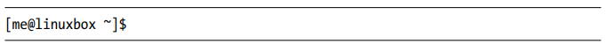
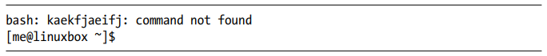
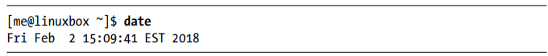
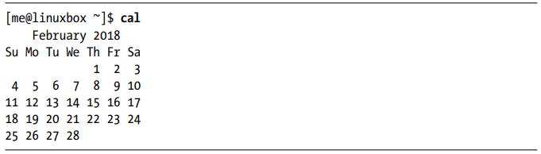

وقتی از خط فرمان صحبت می‌کنیم، در واقع منظور ما شل (پوسته) است. شل یک برنامه‌ای است که دستورات صفحه کلید را دریافت کرده و به سیستم عامل منتقل می‌کند تا اجرا شوند. تقریباً تمام توزیع‌های لینوکس، یک برنامه شل از پروژه گنو به نام bash ارائه می‌دهند. این نام در واقع سرواژه‌ای از عبارت "bourne-again shell" (شل بورن دوباره) است که اشاره‌ای به این موضوع دارد که bash یک جایگزین پیشرفته برای sh محسوب می‌شود - که شل اصلی یونیکس نوشته شده توسط استیو بورن بود.    
# شبیه‌سازهای ترمینال
هنگام استفاده از یک رابط کاربری گرافیکی (GUI)، به برنامه دیگری به نام شبیه‌ساز ترمینال نیاز داریم تا با پوسته (شل) تعامل داشته باشیم. اگر در منوهای دسکتاپ خود جستجو کنیم، احتمالاً یکی از آنها را پیدا خواهیم کرد.    

1. محیط KDE از Konsole استفاده می‌کند.  

2. محیط GNOME از gnome-terminal بهره می‌برد، اگرچه احتمالاً در منوها به سادگی با نام Terminal نمایش داده می‌شود. 

تعداد زیادی شبیه‌ساز ترمینال دیگر نیز برای لینوکس موجود است، اما همه آنها در اصل یک کار را انجام می‌دهند: دسترسی به پوسته (شل) را برای ما فراهم می‌کنند. احتمالاً با توجه به امکانات و قابلیت‌های اضافه‌ای که هر شبیه‌ساز ترمینال ارائه می‌دهد، به یکی از آنها علاقه‌مند خواهید شد.   

# اولین ضربه‌های کلیدتان را بزنید 

پس بیایید شروع کنیم. شبیه‌ساز ترمینال را اجرا کنید. پس از باز شدن، چیزی شبیه به این خواهید دید:  

به این قسمت "پِرُمپت شل" (shell prompt) می‌گویند که هر زمان شل آماده دریافت دستورات باشد، نمایش داده می‌شود. اگرچه ممکن است ظاهر آن بسته به توزیع لینوکس کمی متفاوت باشد، اما معمولاً شامل موارد زیر است:  

نام کاربری@نام ماشین 
،
مسیر دایرکتوری جاری (بعداً بیشتر توضیح داده می‌شود) 
،
علامت دلار ($)

اگر آخرین کاراکتر پرومپت به جای $، علامت هش (#) باشد، به این معنی است که ترمینال با دسترسی سوپریوزر (root) باز شده است.
یعنی یا به عنوان کاربر روت وارد شده‌اید،
یا از یک شبیه‌ساز ترمینال با دسترسی مدیریتی استفاده می‌کنید.   

حالا که همه چیز آماده است، بیایید کمی تایپ کردن را امتحان کنیم!  

چون این دستور هیچ معنی ندارد، شل (پوسته) به ما این موضوع را اطلاع می‌دهد و فرصت دیگری در اختیارمان می‌گذارد.   

 

# تاریخچه دستورات (Command History)

اگر کلید جهت بالا (↑) را فشار دهید، خواهید دید که آخرین دستور وارد شده (kaekfjaeifj) دوباره در خط فرمان ظاهر می‌شود. به این قابلیت «تاریخچه دستورات» گفته می‌شود.
به طور پیش‌فرض، بیشتر توزیع‌های لینوکس آخرین ۱۰۰۰ دستور اجرا شده را ذخیره می‌کنند.
با فشار دادن کلید جهت پایین (↓)، دستور نمایش داده شده دوباره از خط فرمان حذف می‌شود.

# حرکت نشانگر (Cursor Movement)

برای فراخوانی دستور قبلی، دوباره کلید جهت بالا (↑) را فشار دهید. حالا اگر از کلیدهای چپ (←) و راست (→) استفاده کنید، متوجه خواهید شد که می‌توانید نشانگر (کِرْسِر) را در هر نقطه‌ای از خط فرمان قرار دهید. این ویژگی، ویرایش دستورات را بسیار آسان می‌کند.

________________________________________________________________________________________________________________________________________________________________________

# چند نکته درباره ماوس و تمرکز (Focus) 
در حالی که پوسته (Shell) عمدتاً مبتنی بر صفحه‌کلید است، شما می‌توانید از ماوس نیز در شبیه‌ساز ترمینال خود استفاده کنید. مکانیزمی در سیستم پنجره‌ای X (موتور پایه‌ای که رابط گرافیکی را اجرا می‌کند) از یک تکنیک سریع کپی و پیست پشتیبانی می‌کند:

اگر متنی را با نگه‌داشتن کلیک چپ ماوس و کشیدن روی آن (یا دوبار کلیک روی یک کلمه) انتخاب کنید، متن در بافر X ذخیره می‌شود.

با فشار دادن کلیک وسط ماوس، متن در محل نشانگر (کرسور) پیست می‌شود. این روش را امتحان کنید!    

از استفاده از Ctrl+C و Ctrl+V برای کپی و پیست در پنجره ترمینال خودداری کنید! این کلیدها در محیط ترمینال معانی متفاوتی دارند (مثلاً Ctrl+C برای قطع فرآیند جاری استفاده می‌شود) و سال‌ها قبل از مایکروسافت ویندوز تعریف شده‌اند.   

محیط دسکتاپ گرافیکی شما (مثل KDE یا GNOME) احتمالاً تنظیمات تمرکز را به سبک ویندوز («کلیک برای تمرکز») تنظیم کرده است، یعنی برای فعال‌کردن یک پنجره باید روی آن کلیک کنید. این برخلاف رفتار سنتی X تحت عنوان «تمرکز دنباله‌روی ماوس» است که در آن پنجره صرفاً با عبور ماوس روی آن (بدون کلیک) فعال می‌شود (اگرچه برای جلوزدن پنجره همچنان نیاز به کلیک دارید).

تغییر این تنظیم به «تمرکز دنباله‌روی ماوس» باعث می‌شود تکنیک کپی/پیست با ماوس کاربردی‌تر شود.

این گزینه را در تنظیمات مدیر پنجره (Window Manager) خود جستجو کنید (البته برخی محیط‌های مدرن مانند Unity اوبونتو دیگر از آن پشتیبانی نمی‌کنند). 

_________________________________________________________________________________________________________________________________________________________________________

# امتحان چند دستور ساده

حالا که یاد گرفتیم چگونه در شبیه‌ساز ترمینال متن وارد کنیم، بیایید چند دستور ساده را امتحان کنیم.
بیایید با دستور date شروع کنیم که زمان و تاریخ فعلی را نمایش می‌دهد:

 

یک دستور مرتبط cal است ، که به صورت پیش فرض تقویم ماه فعلی را نمایش میدهد . 

 
