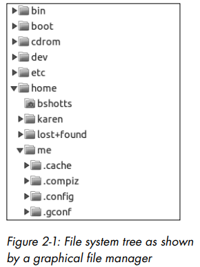
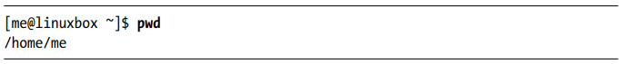
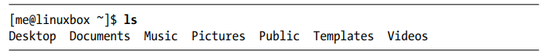
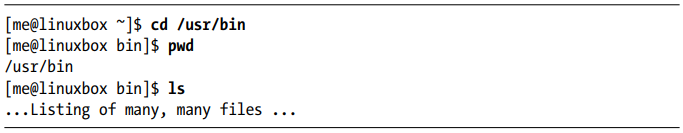
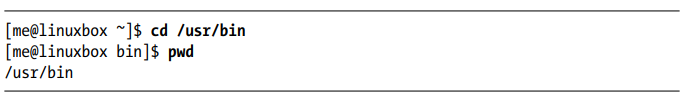
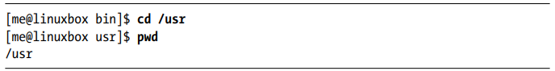
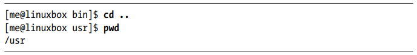
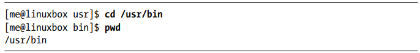
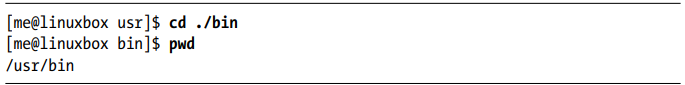
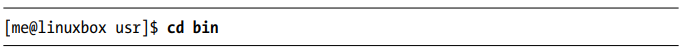

اولین چیزی که باید یاد بگیریم (جز نحوه تایپ کردن) این است که چگونه در سیستم فایل لینوکس حرکت کنیم. در این فصل، دستورات زیر را معرفی خواهیم کرد:

# درک ساختار درختی سیستم فایل

مانند ویندوز، سیستم‌عامل‌های شبه‌یونیکس مانند لینوکس، فایل‌های خود را در ساختاری سلسله‌مراتبی به نام ساختار دایرکتوری سازماندهی می‌کنند. این بدان معناست که فایل‌ها و دایرکتوری‌ها (که گاهی در سایر سیستم‌ها پوشه نامیده می‌شوند) در قالبی درختی مرتب شده‌اند.

اولین دایرکتوری در سیستم فایل، دایرکتوری ریشه (root directory) نام دارد. این دایرکتوری شامل فایل‌ها و زیردایرکتوری‌هایی است که خود می‌توانند حاوی فایل‌ها و دایرکتوری‌های بیشتری باشند و همین‌طور الی آخر.

توجه کنید که برخلاف ویندوز که برای هر دستگاه ذخیره‌سازی یک ساختار درختی مجزای سیستم فایل دارد، سیستم‌های شبه‌یونیکس مانند لینوکس همیشه یک ساختار درختی واحد برای سیستم فایل دارند، بدون توجه به اینکه چند درایو یا دستگاه ذخیره‌سازی به رایانه متصل شده باشد.
دستگاه‌های ذخیره‌سازی در نقاط مختلف این درخت اتصال (یا به عبارت دقیق‌تر، مانت) می‌شوند که این امر بستگی به تنظیمات مدیر سیستم (فرد یا افرادی که مسئول نگهداری سیستم هستند) دارد.

# دایرکتوری کاری فعلی

احتمالاً اکثر ما با مدیر فایل گرافیکی آشنا هستیم که ساختار درختی سیستم فایل را به شکلی مشابه شکل ۲-۱ نمایش می‌دهد.

توجه داشته باشید که این درخت معمولاً به صورت وارانه نمایش داده می‌شود، یعنی ریشه در بالا و شاخه‌های مختلف به سمت پایین گسترده شده‌اند.

اما در محیط خط فرمان، تصویری وجود ندارد. بنابراین برای پیمایش درخت سیستم فایل، باید آن را به شکل دیگری تصور کنیم.

تصور کنید سیستم فایل مانند یک هزارتو به شکل درختی وارونه است و ما می‌توانیم در وسط آن بایستیم. در هر لحظه، داخل یک دایرکتوری خاص قرار داریم که می‌توانیم:
فایل‌های موجود در آن دایرکتوری را ببینیم، 
مسیر به دایرکتوری بالاتر (که به آن دایرکتوری والد می‌گویند) را مشاهده کنیم، 
و زیردایرکتوری‌های پایین‌تر را ببینیم
به دایرکتوری که هم‌اکنون در آن قرار داریم، دایرکتوری کاری فعلی می‌گوییم. برای نمایش دایرکتوری کاری فعلی، از دستور pwd (مخفف print working directory) استفاده می‌کنیم.

هنگامی که برای اولین بار وارد سیستم می‌شویم (یا یک نشست ترمینال را آغاز می‌کنیم)، دایرکتوری کاری فعلی ما بر روی دایرکتوری خانگی تنظیم می‌شود. هر حساب کاربری دارای یک دایرکتوری خانگی اختصاصی است، و این تنها مکانی است که یک کاربر عادی اجازه دارد در آن فایل‌ها را بنویسد.

# نمایش محتویات یک دایرکتوری

برای مشاهده فایل‌ها و پوشه‌های موجود در دایرکتوری کاری فعلی، از دستور ls استفاده می‌کنیم.

در واقع، ما می‌توانیم از دستور ls نه تنها برای نمایش محتوای دایرکتوری جاری، بلکه برای مشاهده محتوای هر دایرکتوری دیگری نیز استفاده کنیم. علاوه بر این، این دستور قابلیت‌های جالب و کاربردی دیگری هم دارد که در فصل ۳ به تفصیل به بررسی آنها خواهیم پرداخت.

# تغییر دایرکتوری کاری فعلی

برای تغییر دایرکتوری کاری (یعنی جایی که در هزارتوی درختی شکل سیستم فایل قرار داریم)، از دستور cd استفاده می‌کنیم. بدین منظور، cd را به همراه مسیر (pathname) دایرکتوری مورد نظر تایپ می‌کنیم. مسیر، راهی است که از میان شاخه‌های این درخت برای رسیدن به دایرکتوری مورد نظرمان طی می‌کنیم.

ما می‌توانیم مسیرها را به دو شیوه مختلف مشخص کنیم:

مسیرهای مطلق (Absolute Pathnames)

مسیرهای نسبی (Relative Pathnames)

ابتدا به بررسی مسیرهای مطلق می‌پردازیم.

### مسیرهای مطلق

یک مسیر مطلق از دایرکتوری ریشه (root) شروع شده و به ترتیب شاخه به شاخه پیش می‌رود تا به دایرکتوری یا فایل مورد نظر برسد. به عنوان مثال، در سیستم شما دایرکتوری وجود دارد که بیشتر برنامه‌های سیستم در آن نصب شده‌اند. مسیر این دایرکتوری /usr/bin است. این بدان معناست که از دایرکتوری ریشه (که با اسلش اول در مسیر نشان داده می‌شود)، یک دایرکتوری به نام usr وجود دارد که شامل دایرکتوری دیگری به نام bin می‌باشد.

اکنون می‌بینیم که دایرکتوری کاری فعلی به /usr/bin تغییر کرده و این دایرکتوری پر از فایل‌های مختلف است. متوجه شدید که چگونه نشانگر خط فرمان (shell prompt) تغییر کرده است؟ برای راحتی کار، این نشانگر معمولاً طوری تنظیم می‌شود که به طور خودکار نام دایرکتوری کاری فعلی را نمایش دهد.

### مسیرهای نسبی

در حالی که مسیر مطلق از دایرکتوری ریشه شروع شده و تا مقصد ادامه می‌یابد، مسیر نسبی از دایرکتوری کاری فعلی آغاز می‌شود. برای این کار از دو نماد ویژه برای نمایش موقعیت‌های نسبی در ساختار درختی سیستم فایل استفاده می‌شود. این نمادهای ویژه عبارتند از:

. (نقطه)

.. (دو نقطه)

نماد . به دایرکتوری فعلی اشاره دارد و نماد .. به دایرکتوری والد (سطح بالاتر) اشاره می‌کند. نحوه عملکرد این نمادها به این صورت است:
بیایید دوباره دایرکتوری کاری را به /usr/bin تغییر دهیم.

حال فرض کنید بخواهیم دایرکتوری کاری را به دایرکتوری والد /usr/bin که همان /usr است تغییر دهیم. این کار را می‌توانیم به دو روش مختلف انجام دهیم:

یا با استفاده از مسیر نسبی:

دو روش متفاوت با نتایج یکسان.
کدام روش را باید انتخاب کنیم؟ روشی که نیاز به تایپ کمتری دارد!
به همین ترتیب، می‌توانیم دایرکتوری کاری را از /usr به /usr/bin با دو روش مختلف تغییر دهیم:
با استفاده از مسیر مطلق (آدرس کامل):

یا با استفاده از مسیر نسبی:

نکته مهمی که باید به آن توجه کرد:
در تقریباً تمام موارد می‌توانیم بخش ./ را حذف کنیم، زیرا به صورت پیش‌فرض implied (ضمنی) در نظر گرفته می‌شود. تایپ کردن دستور زیر دقیقاً همان نتیجه را خواهد داشت:

به طور کلی،
اگر ما مسیری را برای دستور مشخص نکنیم، سیستم به طور پیش‌فرض از دایرکتوری کاری فعلی استفاده خواهد کرد.
