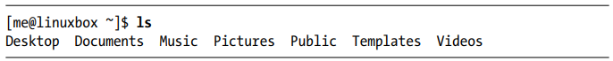
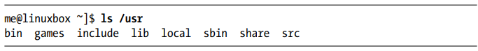
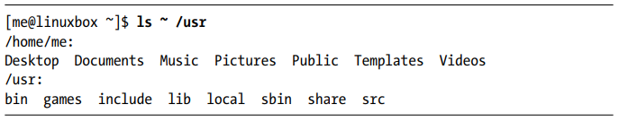
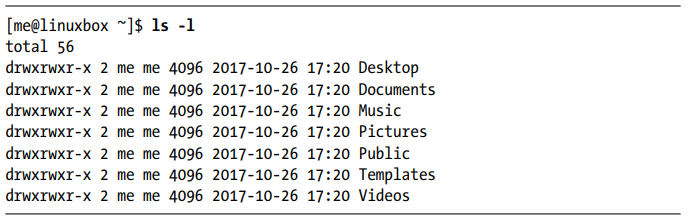

اکنون که می‌دانیم چگونه در سیستم فایل حرکت کنیم،
زمان آن رسیده که یک تور راهنماشده از سیستم لینوکس خود داشته باشیم.

# کاربردهای جذاب دستور ls

دستور ls احتمالاً پراستفاده‌ترین دستور در لینوکس است - و این محبوبیت دلیلی دارد!

علاوه بر دایرکتوری کاری فعلی، می‌توانیم دایرکتوری مورد نظر برای نمایش محتوا را به صورت زیر مشخص کنیم:

حتی می‌توانیم چندین دایرکتوری را همزمان مشخص کنیم. در مثال زیر، هم دایرکتوری خانگی کاربر (که با نماد ~ نشان داده می‌شود) و هم دایرکتوری /usr را فهرست می‌کنیم:

همچنین می‌توانیم فرمت خروجی را تغییر دهیم تا جزئیات بیشتری نمایش داده شود.

